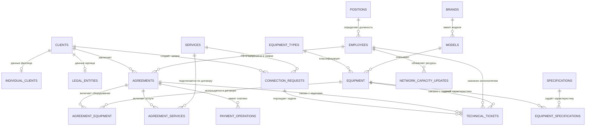
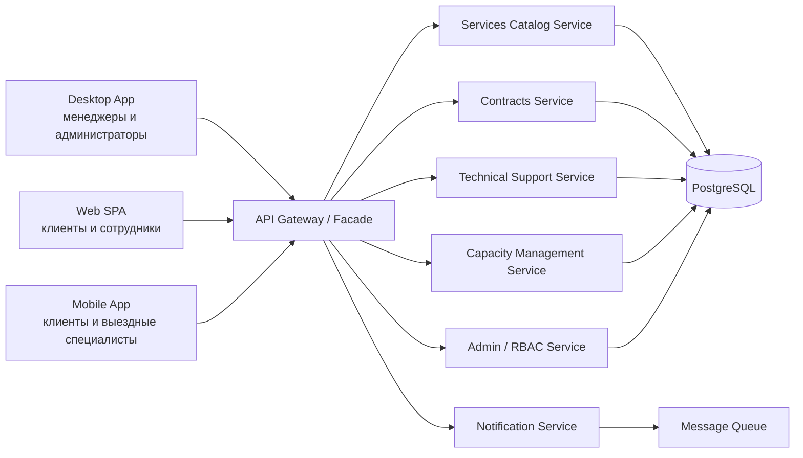

# Проектирование БД и архитектуры системы интернет‑провайдера


Проект информационной системы для интернет‑провайдера: от анализа предметной области и ERD до нормализованной реляционной модели, SQL‑реализации, ролей доступа, представлений, функций, процедур и архитектурной документации.

> Репозиторий собран из учебных работ по дисциплинам IThub College **«СУБД PostgreSQL, MySQL»**, **«Основы анализа и проектирования баз данных»** и **«Сборка полнофункциональных приложений»**.

## Что демонстрирует проект

- анализ предметной области и выделение ключевых сущностей;
- проектирование ERD и нормализованной реляционной модели;
- реализацию схемы БД в PostgreSQL: таблицы, первичные и внешние ключи, `CHECK`, `UNIQUE`, индексы;
- работу с PostgreSQL‑объектами: `VIEW`, `FUNCTION`, `PROCEDURE`, роли и права доступа;
- MySQL‑совместимую версию схемы;
- системное проектирование: клиентские приложения, API Gateway, доменные сервисы, БД и уведомления.

## Предметная область

Система моделирует работу интернет‑провайдера, который оказывает услуги подключения, продаёт или сдаёт оборудование, заключает договоры, обрабатывает заявки клиентов, ведёт платежи и управляет техническими ресурсами сети.

Основные группы пользователей:

| Роль | Что делает |
| --- | --- |
| Клиент | Оставляет заявку на подключение, смотрит услуги, договоры, платежи и обращения в поддержку. |
| Менеджер по клиентам | Регистрирует клиентов, оформляет договоры, обрабатывает заявки и платежи. |
| Специалист технической поддержки | Работает с заявками на подключение, оборудованием и техническими обращениями. |
| Главный технический специалист | Управляет каталогом оборудования, услугами и доступной пропускной способностью сети. |
| Администратор | Управляет сотрудниками, ролями, справочниками и правами доступа. |

## Структура репозитория

```text
.
├── docs/
│   ├── requirements-analysis.md      # анализ требований и предметной области
│   ├── database-design.md            # проектирование БД и ERD
│   ├── data-dictionary.md            # словарь данных
│   ├── system-architecture.md        # архитектура приложения
│   ├── validation-rules.md           # правила валидации и целостности
│   ├── source-materials-summary.md   # происхождение и обработка учебных материалов
│   ├── privacy-and-sanitization.md   # очистка данных перед публикацией
│   └── reviewer-guide.md             # короткий маршрут по проекту
├── diagrams/
│   ├── erd.mmd                       # ERD в Mermaid
│   ├── architecture.mmd              # архитектурная схема
│   └── user-flows.mmd                # пользовательские сценарии
├── sql/
│   ├── postgresql/
│   │   ├── 01_schema.sql             # схема БД
│   │   ├── 02_seed_data.sql          # безопасные демо-данные
│   │   ├── 03_indexes.sql            # индексы
│   │   ├── 04_views.sql              # представления
│   │   ├── 05_functions.sql          # функции
│   │   ├── 06_procedures.sql         # хранимые процедуры
│   │   ├── 07_roles_permissions.sql  # роли и права доступа
│   │   └── 08_demo_queries.sql       # демонстрационные запросы
│   └── mysql/
│       ├── 01_schema.sql             # MySQL-совместимая схема
│       ├── 02_seed_data.sql          # демо-данные для MySQL
│       └── README.md
├── docker-compose.yml
├── Makefile
├── .env.example
└── README.md
```

## Быстрый запуск PostgreSQL

Требования: установленный Docker и Docker Compose.

```bash
docker compose up -d postgres
```

При первом запуске PostgreSQL автоматически применит SQL‑файлы из `sql/postgresql`.

Подключиться к базе:

```bash
docker compose exec postgres psql -U portfolio -d internet_provider
```

Запустить демонстрационные запросы:

```bash
docker compose exec postgres psql -U portfolio -d internet_provider -f /docker-entrypoint-initdb.d/08_demo_queries.sql
```

Полностью пересоздать БД:

```bash
docker compose down -v
docker compose up -d postgres
```

Или через `Makefile`:

```bash
make reset
make psql
make demo
```

Запустить PostgreSQL вместе с pgAdmin:

```bash
make pgadmin
```

pgAdmin будет доступен на `http://localhost:5050`.

## ERD



## Архитектура приложения



## Что реализовано в PostgreSQL

| Блок | Реализация |
| --- | --- |
| Таблицы | 19 нормализованных таблиц. |
| Ограничения | `PRIMARY KEY`, `FOREIGN KEY`, `UNIQUE`, `CHECK`, `NOT NULL`. |
| Индексы | Индексы для поиска, связей и частых отчётных сценариев. |
| Представления | Каталог услуг/оборудования, договоры клиентов, статусы оплат, очередь техподдержки. |
| Функции | Описание оборудования, расчёт суммы договора, задолженность, проверка доступной мощности. |
| Процедуры | Создание заявки, регистрация платежа, назначение технической задачи. |
| RBAC | Отдельные роли для администратора, менеджера, технического руководителя, поддержки и клиента. |
| Демо-данные | Синтетические безопасные данные без реальных персональных данных. |

## Что посмотреть в первую очередь

1. [`sql/postgresql/01_schema.sql`](sql/postgresql/01_schema.sql) — основная структура БД.
2. [`docs/database-design.md`](docs/database-design.md) — логика проектирования и нормализация.
3. [`docs/system-architecture.md`](docs/system-architecture.md) — архитектура приложения вокруг БД.
4. [`sql/postgresql/04_views.sql`](sql/postgresql/04_views.sql) — представления для отчётных сценариев.
5. [`sql/postgresql/05_functions.sql`](sql/postgresql/05_functions.sql) и [`06_procedures.sql`](sql/postgresql/06_procedures.sql) — бизнес‑логика на уровне БД.
6. [`docs/reviewer-guide.md`](docs/reviewer-guide.md) — короткий маршрут по проекту.

## Важные проектные решения

- Общие данные клиентов вынесены в `clients`, а данные физических и юридических лиц — в отдельные таблицы `individual_clients` и `legal_entities`.
- Цены услуг и оборудования дублируются в деталях договора, чтобы исторические договоры не менялись после обновления каталога.
- Оборудование разнесено на типы, бренды, модели и характеристики, чтобы избежать хранения повторяющихся текстовых описаний.
- Технические заявки отделены от клиентских заявок на подключение: это позволяет хранить и коммерческий, и технический процесс.
- Для публичного репозитория используются только синтетические демо‑данные.

## Статус

Проект завершён и демонстрирует полный путь от анализа предметной области до документированной и исполняемой модели данных для PostgreSQL/MySQL.
