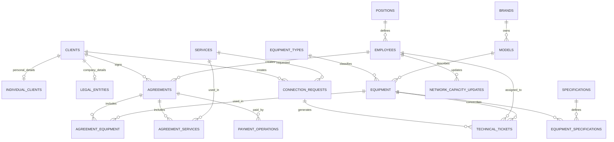

# Проектирование базы данных

## Подход к проектированию

Проектирование БД построено по классическому пути от предметной области к физической схеме:

1. Выделить объекты из бизнес‑описания интернет‑провайдера.
2. Преобразовать объекты в сущности и атрибуты.
3. Определить первичные и суррогатные ключи.
4. Вынести повторяющиеся данные в справочники и таблицы связей.
5. Построить логическую ERD.
6. Преобразовать логическую модель в физическую схему PostgreSQL/MySQL.
7. Добавить ограничения, индексы, представления, функции, процедуры и роли доступа.

## Основные сущности

| Область | Сущности |
| --- | --- |
| Пользователи и роли | `positions`, `employees`, `clients`, `individual_clients`, `legal_entities` |
| Каталог | `services`, `equipment_types`, `brands`, `models`, `equipment`, `specifications`, `equipment_specifications` |
| Договоры | `agreements`, `agreement_equipment`, `agreement_services` |
| Операции | `payment_operations`, `connection_requests`, `technical_tickets`, `network_capacity_updates` |

## Решения по нормализации

| Проблема в исходной предметной области | Решение в модели данных |
| --- | --- |
| Описание оборудования включало тип, бренд и модель в одном текстовом поле. | Типы, бренды и модели вынесены в `equipment_types`, `brands`, `models`. |
| У оборудования может быть несколько характеристик. | Используется таблица связи `equipment_specifications`. |
| У физических и юридических лиц разные наборы полей. | Общие данные вынесены в `clients`, специфичные — в `individual_clients` и `legal_entities`. |
| Договор может включать несколько услуг и несколько единиц оборудования. | Используются детализационные таблицы `agreement_services` и `agreement_equipment`. |
| Цены в каталоге могут меняться со временем. | Фактические цены сохраняются в деталях договора. |
| По одному договору может быть несколько платежей. | Используется `payment_operations` с типом операции и суммами. |
| Доступные сетевые ресурсы меняются во времени. | Хранятся снимки состояния в `network_capacity_updates`. |

## ERD

## Ключевые правила целостности

- Каждый договор относится к одному клиенту и одному сотруднику.
- Услуги и оборудование договора хранятся в отдельных детализационных таблицах.
- Физическое лицо и юридическое лицо расширяют одну запись из `clients`.
- Оборудование относится к одному типу и одной модели.
- Модель относится к одному бренду.
- Техническая задача может быть связана с заявкой, договором и оборудованием.
- Платежные операции не могут иметь отрицательные суммы.
- Оплаченная сумма не может быть больше начисленной.
- День оплаты по договору ограничен диапазоном 1–28, чтобы избежать проблем с короткими месяцами.

## Физическая реализация

PostgreSQL‑реализация использует:

- `BIGINT GENERATED ALWAYS AS IDENTITY` для суррогатных ключей;
- `CHECK` для статусов, числовых ограничений и форматов;
- регулярные выражения для отдельных форматированных полей;
- `ON DELETE CASCADE` для зависимых детализационных таблиц;
- `ON DELETE SET NULL` для сохранения истории технических задач;
- отдельные read‑модели в виде SQL‑представлений;
- функции и процедуры для типовых бизнес‑операций.
