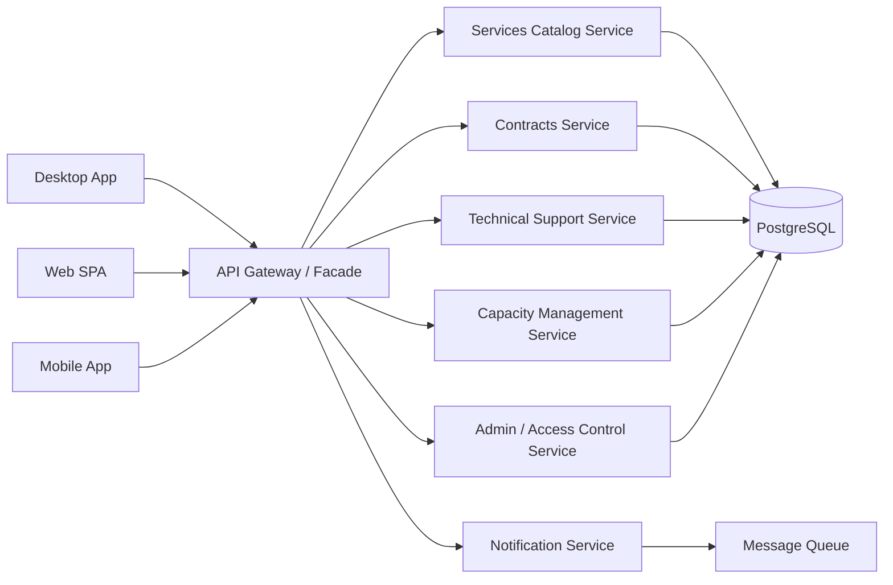

# Архитектура системы

## Типы приложений

В рамках проектирования рассматривались три типа клиентских приложений:

| Приложение | Пользователи | Назначение |
| --- | --- | --- |
| Desktop App | Менеджеры, техническая поддержка, администраторы | Внутренние офисные процессы: регистрация клиентов, договоры, технические задачи. |
| Web SPA | Клиенты и сотрудники | Доступ из браузера к услугам, договорам, заявкам, платежам и обращениям. |
| Mobile App | Клиенты и выездные специалисты | Быстрый просмотр статусов, обновление задач, push‑уведомления. |

## Backend‑архитектура

Проектная архитектура использует API Gateway / Facade как единую точку входа для клиентских приложений. Это упрощает клиентов и отделяет внешнее API от внутренних доменных модулей.

## Модули

| Модуль | Ответственность |
| --- | --- |
| API Gateway / Facade | Единая точка входа для desktop, web и mobile клиентов. Маршрутизирует запросы к доменным сервисам. |
| Services Catalog | Управляет услугами, оборудованием, брендами, моделями и характеристиками. |
| Contracts | Управляет клиентами, договорами, услугами/оборудованием договора и платежами. |
| Technical Support | Управляет заявками на подключение и техническими задачами. |
| Capacity Management | Хранит снимки сетевой мощности и проверяет доступность ресурсов. |
| Admin / Access Control | Управляет сотрудниками, ролями и правами. |
| Notifications | Отправляет уведомления об изменении статусов и платежах. |

## Используемые архитектурные паттерны

| Паттерн | Почему подходит |
| --- | --- |
| Facade | API Gateway скрывает сложность внутренних сервисов от клиентских приложений. |
| Repository | Отделяет доступ к данным от бизнес‑логики. |
| Factory | Может использоваться для создания договоров, заявок и технических задач с дефолтными значениями. |
| Singleton | Подходит для общей конфигурации или пула подключений к БД. |
| Observer / Pub‑Sub | Удобен для уведомлений при изменении статусов заявок, задач и оплат. |

## Предположения по развёртыванию

| Компонент | Возможное окружение |
| --- | --- |
| Web SPA | CDN/static hosting или контейнеризованный frontend. |
| API Gateway и сервисы | Linux‑сервер или контейнерная платформа. |
| PostgreSQL | Managed PostgreSQL или выделенный контейнер/сервер БД. |
| Queue/notifications | Опциональный брокер сообщений для асинхронных уведомлений. |

Этот репозиторий реализует слой базы данных и документирует архитектуру приложения. Production‑backend API в состав проекта не входит.
